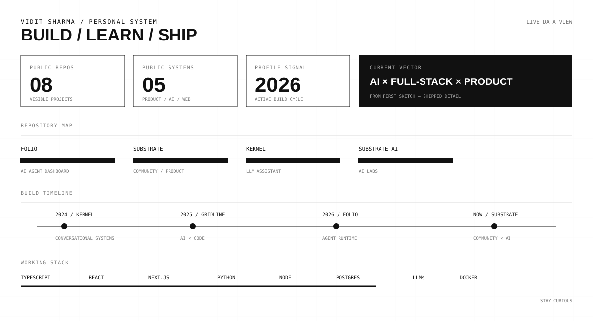

<div align="center">

<a href="https://viditsharma.vercel.app/"></a>

</div>

<br>

<div align="center">

<a href="https://github.com/viditpvttttt?tab=followers"></a>
<a href="https://github.com/viditpvttttt?tab=repositories"></a>
<a href="https://github.com/viditpvttttt"></a>
<a href="https://github.com/viditpvttttt/viditpvttttt/commits/main"></a>
<a href="https://github.com/viditpvttttt/viditpvttttt/actions"></a>

<br>


</div>

<div align="center"><code>01 / SIGNAL</code></div>

I build digital products around **AI, full-stack engineering, and useful interfaces** — moving from idea → system → shipped detail.

This profile is intentionally closer to a **living dashboard than a traditional portfolio**: repositories, build cycles, technologies, and activity are the primary signal.

---

<div align="center"><code>02 / ACTIVITY</code><br><br></div>

---

<div align="center"><code>03 / SYSTEMS</code></div>

### folio-org
**AI agent dashboard** — tools, context, and execution brought into one product surface.

[Repository ↗](https://github.com/viditpvttttt/folio-org)

### kernel
**LLM-based product system** — a focused conversational layer for useful AI workflows.

[Repository ↗](https://github.com/viditpvttttt/kernel)

### kernel-ai-assistant
**AI assistant implementation** — an applied extension of the Kernel direction.

[Repository ↗](https://github.com/viditpvttttt/kernel-ai-assistant)

### substrate.devs-V2- · Substrate.Devs- · substrate-ai-labs
**Substrate ecosystem** — product, community, and AI experimentation moving through multiple iterations.

---

<div align="center"><code>04 / BUILD GRAPH</code><br><br>

```text
2024 ───────────● KERNEL
                 │
2025 ───────────────● GRIDLINE
                     │
2026 ───────────────────● FOLIO
                         │
NOW ───────────────────────● SUBSTRATE
```

</div>

The interesting part is the **continuity between systems**: conversational interfaces → AI × code → agent infrastructure → product/community systems.

---

<div align="center"><code>05 / STACK</code></div>

| Layer | Working set |
|---|---|
| **Language** | TypeScript · JavaScript · Python · C++ · SQL |
| **Interface** | React · Next.js · Tailwind CSS · shadcn/ui · Motion |
| **Backend** | Node.js · Bun · Express · Flask · FastAPI |
| **Data** | PostgreSQL · MongoDB · Redis · MySQL · Prisma · Drizzle |
| **AI** | LLMs · RAG · LangChain · LangGraph · embeddings · Hugging Face |
| **Infrastructure** | Docker · Kubernetes · Vercel · AWS |
| **Workflow** | GitHub · Cursor · Claude · Gemini · ChatGPT · n8n |

---

<div align="center"><code>06 / PRINCIPLES</code><br><br>**MAKE IT USEFUL** &nbsp; · &nbsp; **SWEAT THE DETAILS** &nbsp; · &nbsp; **STAY CURIOUS**</div>

---

<div align="center"><code>07 / CONNECT</code><br><br><a href="https://viditsharma.vercel.app/">Website</a> · <a href="https://github.com/viditpvttttt">GitHub</a> · <a href="https://x.com/vidit1727">X</a> · <a href="https://instagram.com/vidit5791">Instagram</a> · <a href="https://linkedin.com/in/vidit-sharma-914202380">LinkedIn</a> · <a href="https://leetcode.com/u/Vidzzzzz17/">LeetCode</a><br><br><sub>Built as a data-driven profile, not a static résumé.</sub></div>
