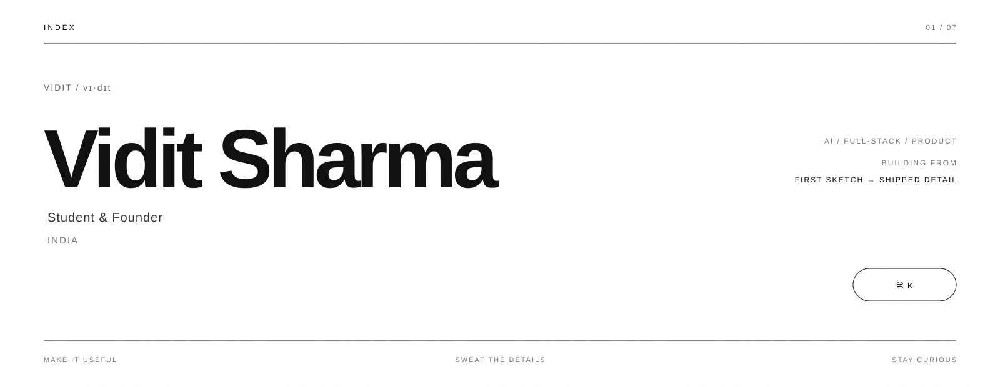
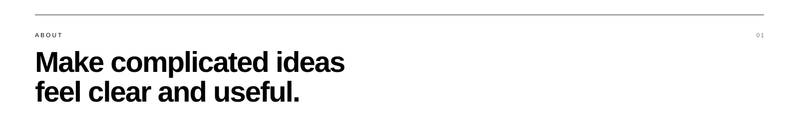
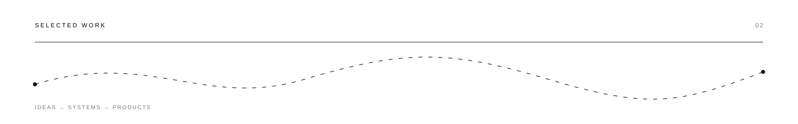
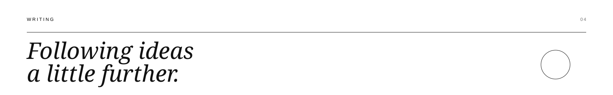
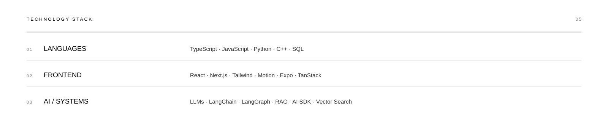
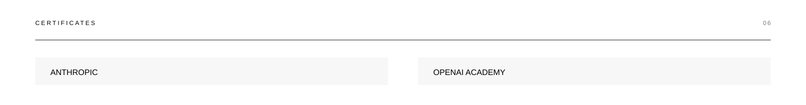
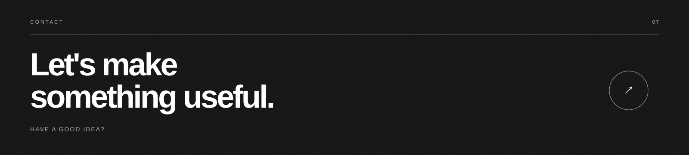

 

---

`01 / ABOUT`

 

I build thoughtful digital products that make complicated ideas
feel clear and useful.

Right now I'm deep in **AI, full-stack engineering, and building
products from the first sketch to the shipped detail.**

I'm open to ambitious ideas, thoughtful collaborators,
and hard problems worth solving.

 

**01 / Make it useful**  
**02 / Sweat the details**  
**03 / Stay curious**

 

---

`02 / SELECTED WORK`

 

### 01 — Folio

**AI agent dashboard**

A shared runtime for tools, context, and execution —
turning ambitious ideas into repeatable workflows.

`React` · `TypeScript` · `Vercel`

**2026** ↗

---

### 02 — Gridline

**AI-powered code editor**

A focused environment that makes the distance between
an idea and a working prototype feel smaller.

`TypeScript` · `React` · `AI tooling`

**2025** ↗

---

### 03 — Kernel

**LLM-based chatbot**

A conversational layer for powerful tools,
designed to feel direct, useful, and human.

`LLMs` · `Shared runtime`

**2024** ↗

 

---

`03 / ACTIVITY`

 

 

---

`04 / WRITING`

 

Notes from building products, learning the craft,
and following ideas a little further.

 

### 01 · Essay

## Building Substrate: one runtime, three products

Why Kernel, Gridline, and Folio share infrastructure
instead of being built as separate apps — and what that trade-off costs.

`8 min` · `2026`

---

### 02 · Process

## Designing Kernel’s mark

A process note on finding a mark for Kernel:
gradients, abstraction, and the useful failures in between.

`5 min` · `2026`

---

### 03 · Notes

## What a year on Folio taught me about scope

An honest audit of product scope, security debt,
and the roadmap that came out of taking a closer look.

`7 min` · `2025`

---

### 04 · Build log

## A generative art experiment in Canvas

A Canvas experiment in organic motion,
restrained palettes, and the unglamorous work of keeping it smooth.

`6 min` · `2025`

---

### 05 · Build log

## Small tool, real use: building an attendance streak tracker

A weekend-sized tool for tracking attendance,
marking holidays, and exporting the result as an image.

`4 min` · `2025`

---

### 06 · Notes

## Dynamic programming patterns I keep coming back to

A practical way to recognize recurring dynamic programming
shapes when a problem looks unfamiliar.

`9 min` · `2025`

 

---

`05 / TECHNOLOGY`

 

### 01 — Languages

`TypeScript` · `JavaScript` · `Python` · `C++` · `SQL`

### 02 — Frontend

`React` · `Next.js` · `Tailwind CSS` · `shadcn/ui`
· `Radix UI` · `Base UI` · `Motion` · `Expo`
· `TanStack` · `MobX-State-Tree`

### 03 — Backend & Database

`Node.js` · `Bun` · `PostgreSQL` · `MongoDB`
· `Redis` · `nginx` · `Express.js` · `Flask`
· `FastAPI` · `MySQL` · `Prisma` · `Drizzle ORM`
· `Supabase` · `Firebase` · `REST APIs` · `JWT`

### 04 — Workflow & AI

`Claude` · `Cursor` · `Gemini` · `ChatGPT`
· `GitHub` · `AI SDK` · `LangChain` · `LangGraph`
· `RAG` · `Pinecone` · `Qdrant` · `Scikit-Learn`
· `Pydantic` · `Hugging Face` · `Vector Embeddings`
· `Groq` · `n8n` · `LLMs`

### 05 — Infrastructure

`Docker` · `Kubernetes` · `Vercel` · `AWS`

### 06 — Analytics

`OpenPanel` · `PostHog`

### 07 — Design

`Figma` · `Paper` · `Photoshop`

 

---

`06 / CERTIFICATES`

 

**Anthropic** · **OpenAI Academy**

 

---

`07 / CONTACT`

 

 

# Let's make
# something useful.

 

Have a good idea?

**[Get in touch ↗](https://viditsharma.vercel.app/)**

 

[Website](https://viditsharma.vercel.app/)
&nbsp;&nbsp;·&nbsp;&nbsp;
[GitHub](https://github.com/viditpvttttt)
&nbsp;&nbsp;·&nbsp;&nbsp;
[X](https://x.com/vidit1727)
&nbsp;&nbsp;·&nbsp;&nbsp;
[Instagram](https://instagram.com/vidit5791)
&nbsp;&nbsp;·&nbsp;&nbsp;
[LinkedIn](https://linkedin.com/in/vidit-sharma-914202380)
&nbsp;&nbsp;·&nbsp;&nbsp;
[LeetCode](https://leetcode.com/u/Vidzzzzz17/)

 

---

Crafted by Vidit Sharma · India · 2026

 

Make it useful · Sweat the details · Stay curious

